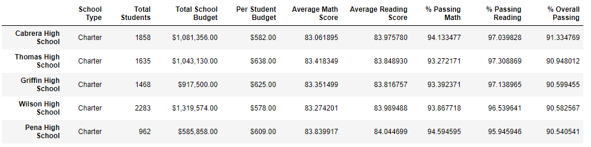
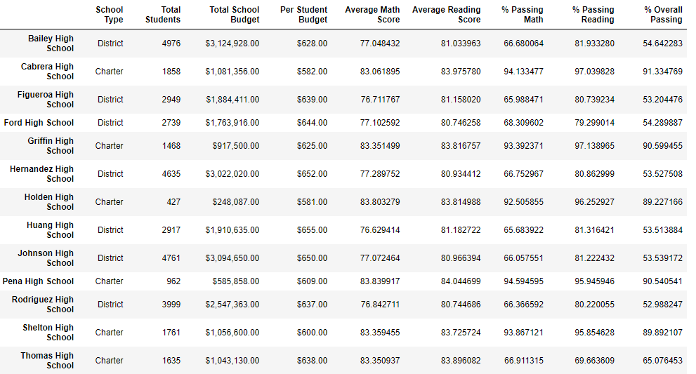
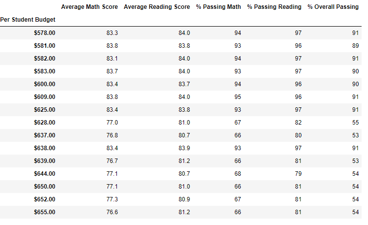
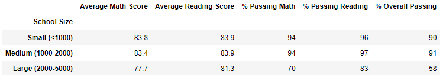
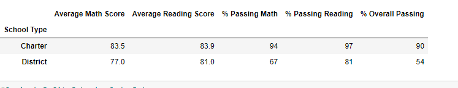

# School_District_Analysis
## Project Overview
### The purpose of this project is to analyze the school district data to find a possible correlation betwwen funding and student performance. All data used in this analysis is located here: [Resources](Resources/) The analysis was completes using Jupyter Notebook

## Results
###Due to posiible academic dishonesty the analysis was done twice. Once with the full set of student data and a second time, excluding scores from the Thomas High Scholl 9th graders. 
*The second analysis yielded the folowing results:
  *Overall passing percenteages at Thaoms High School went from 90 to 65%. Koncking Thoams High out of the top five schools. 
  
  
  
  
  *Overall passing percentages at the the distrcit level were barley impacted.
 ###Budget compared to studnet scores
 *THere seems to be little correlation between higher budget amounts, average scores and passing percentages. The top performing school did not recieve the most dollars.
 
 
 
 ###School Size compared to studnet scores
 *Based on the data, it appears that larger schools have the lowest average scores and passing percentages
 
 
 
 ###Charter vs Distrct Schools
 *The data indicates Charter scholls out perform distraict schools. The top schools based on overall passing percentage were all Charter Schools. 
 
 ###Grade Level
 *It appears both reading and math scores were consistent across grade levels. There was no great disparity here.
 
 ##Summary
 
 ###We discovered the following:
 *Removing the ninth graders scores from the analysis had a negative impact on the overall passing percentage at Thomas High School
 *School bugets had little impact on student performance
 *Students at larger schools have loxer scores than students at medium and small schools
 *Charter schools have higher scores than district schools.
 *Reading and Math scores were consistent accross all grades. 
